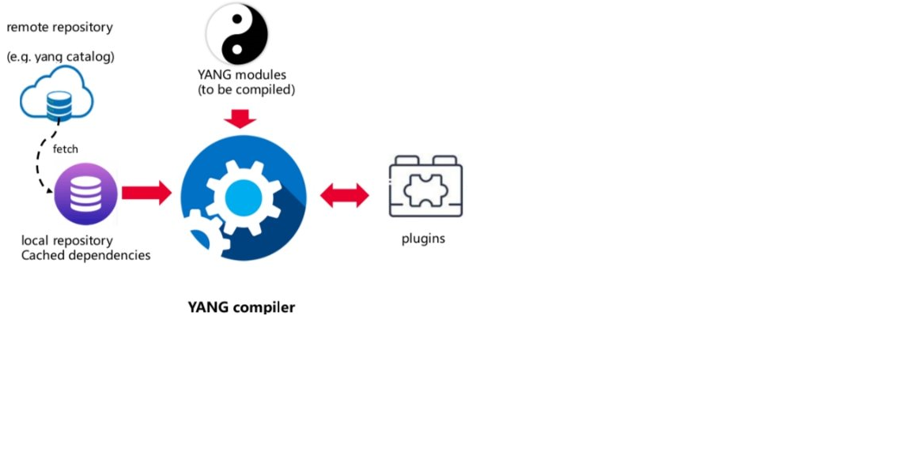

# **YANG Compiler**
## Overview
Yang compiler is a tool based on [YangKit](https://github.com/yang-central/yangkit), it's designed to solve the problem of YANG files compilation dependencies.
For example, after a YANG module is written, if you want to validate it, you need to add all missing YANG module dependencies to your path. This could be troublesome because dependencies are chained, and the chain of dependencies for a YANG module may be very long. In addition,
where these dependented YANG files are archived and how to obtain these YANG files are also difficult problems. This brings great inconvenience to users and
affects their enthusiasm for using YANG.

Yang compiler provide a mechanism to get the dependencies automatically when compiling YANG modules. Firstly, it will search the dependencies from yang sources to be complied, if not found, it will search these YANG files from local repository(it's defined in settings.json or default directory), and if it's not found also, it will search the dependencies from module information defined in settings.json(if available), and according to the information to download the YANG files. if it's still not found, it will search the dependencies for remote repository(defined in settings.json or
[yangcatalog](https://yangcatalog.org/api/) by default). If the dependencies are fetched, it will be saved into local repository.

Using Yang compiler, you can compile any YANG file regardless where it's dependencies are. Yang compiler allow developer to develop
plugin to extend customized functions.
## Architecture

## Specification
* search and download dependencies automatically.
* allow user to customize settings for compilation.
    * customize local repository,{user.home}/.yang is default.
    * customize remote repository, [yangcatalog](https://yangcatalog.org/api/) is default.
    * support proxy.
    * define module information directly if some modules are not in [yangcatalog](https://yangcatalog.org/api/).
* allow user to install yang files which are compiled OK.
* allow developer to develop customized plugin.


## Installation
### &emsp;Prerequisites
* JDK or JRE 1.8 or above

### &emsp;Obtain code
```
# git clone https://github.com/yang-central/yang-compiler.git
```
### &emsp;Build code
```
# cd yang-compiler
# mvn clean install
```
&emsp;it will generate yang-compiler-1.0-SNAPSHOT.jar and libs directory under the directory target.

### &emsp;Make application package for YANG compiler
1.  create a directory in anywhere (of your computer), we may call it application directory. The name of directory should be yang-compiler-x.y.z(e.g., yang-compiler-1.0.0)
2.  copy yang-compiler-1.0-SNAPSHOT.jar and libs to the application directory you created in previous step.
3.  (optional)place settings.json into application directory if needed.
4.  (optional)create a sub-directory named 'plugins' under application directory if external plugins are need, then place plugins.json into this directory.
#### &emsp;&emsp;Example of application package
```
|--yang-compiler-1.0.0
   |--libs
   |--plugins
   |----plugins.json
   |--settings.json
   |--yang-compiler-1.0.0.jar
```

## Specification of settings
1. local-repository: local repo directory to find the missing yang module dependencies, the default directory is {user.home}/.yang
2. remote-repository: remote url, it will fetch the yang module dependencies to local repo if yang compiler request, [yangcatalog](https://yangcatalog.org/api/) is default.
3. proxy: the proxy information, if you are in local network and can't access internet directly, the proxy information must be provided.
    1.  url: the url of proxy including port number.
    2.  authentication: the authentication information, username and password should be provided if needed by proxy.
4. token: the token information, if the remote repo needed.
5. module-info: the information of yang schema. if some dependencies are not in local and remote repos, you can specify the schema information by hand.
    1. name:  module name,mandatory.
    2. revision: revision date,mandatory.
    3. schema: the url where the yang schema stores.
### &emsp;Example:
```json
 {
   
    "settings": {

      "local-repository": "/Users/llly/yang",

      "remote-repository": "https://yangcatalog.org/api/",
      
      "proxy": {
         
          "url":"http:proxy.mydomain.com:8080",
          
           "authentication": {
              
              "username":"foo",
              
              "password":"bar"
            
            }

       },

       "module-info": [
         {
           
            "name": "openconfig-acl",

            "revision": "2022-01-14",

            "schema": "https://raw.githubusercontent.com/openconfig/public/master/release/models/acl/openconfig-acl.yang"

          },

          {
             "name": "openconfig-packet-match-types",

              "revision": "2021-07-14",

              "schema": "https://raw.githubusercontent.com/openconfig/public/master/release/models/acl/openconfig-packet-match-types.yang"

           }

        ]

     }

}
```
## Develop plugin
The plugin system of Yang compiler support built-in plugin and external plugin. Built-in plugin is in yang-compiler project, and external plugin can be in anywhere.
### &emsp;Specification of plugin information
1.  name: the name of plugin, it MUST be unique.
2.  class-path: the class path of plugin class, it MUST be provided when the plugin is an external plugin. It can be relative path or absolute path,
    if it's a relative path, the base path is plugins directory of application directory.

3.  class: class name which implements org.yangcentral.yangkit.compiler.plugin.YangCompilerPlugin.
4.  description: some description information about this plugin.
5.  parameter: parameter information, it's json array. name and description of a parameter MUST be provided.

### &emsp;How to develop a built-in plugin
1. specified a unique plugin name. e.g. yang-tree-generator.
2. write a java class implements YangCompilerPlugin.
   @see [YangValidator](src/main/java/org/yangcentral/yangkit/plugin/yangtree/YangTreeGenerator.java)
3. add plugin information in plugins.json(in src/main/resource)
#### &emsp;&emsp;Example
 ```json
    {

           "plugins": {
   
              "plugin": [
   
                 {
   
                    "name": "validator_plugin",

                    "class": "org.yangcentral.yangkit.compiler.plugin.validator.YangValidator",
   
                    "description": "a plugin for validating yang files",
   
                    "parameter": [
   
                       {
   
                          "name": "output",
   
                          "description": "the output directory."
   
                       }
   
                    ]
   
                 }
   
             ]
   
           }
   
    }
 ```
### &emsp;How to develop an external plugin
1.  specified a unique plugin name. e.g. yang-tree-generator.
2.  create a java project, and write a java class implements YangCompilerPlugin.
3.  build the java project, and get the corresponding jar.
4.  add plugin information to plugins.json ({application directory}/plugins/plugins.json), class-path MUST point to the jar generated at previous step.
#### &emsp;&emsp;Example
```json
{
  "plugins": {
    "plugin": [
      {
        "name": "yang_comparator",
        "class-path": "yang-comparator/yang-comparator-1.0-SNAPSHOT.jar",
        "class": "com.huawei.yang.comparator.YangComparatorPlugin",
        "description": "a plugin for comparing two yang schema.",
        "parameter": [
          {
            "name": "old-yang",
            "description": "mandatory,the old version yang directory."
          },
          {
            "name": "settings",
            "description": "optional,the settings file path."
          },
          {
            "name": "compare-type",
            "description": "mandatory, specify compare-type, one of stmt,tree,or compatible-check"
          },
          {
            "name": "rule",
            "description": "optional, specify the path of compatible-rule file."
          },
          {
            "name": "result",
            "description": "mandatory, specify the compare result file path, the result file is a xml format."
          }
        ]
      }
    ]
  }
}
```
## Compile YANG modules:
1.  make a yang compiler project. You can create a directory in anywhere of your computer.
2.  make a directory under project directory as target directory where YANG modules what you want to compile store. 'yang' is recommended as the name of the directory.
3.  place build.json into project directory. The build.json specify the options of this compilation.
4.  execute the commandline to compile YANG modules.
### &emsp;Example of yang compiler project
```
|--yang-test(project name)
  |--yang(yang modules to be compiled)
  |--build.json
```
### &emsp;Specification of compilation options
1.  yang: source yang information, support directory, file list, module information, or hybrid.
2.  settings: specify the path of settings.json, optional, if it's not present, the {user.home}/.yang/settings.json will be used.
3.  plugin: a json array,specify the parameters of plugins which will be called.
    1. name: the plugin name.
    2. parameter: the parameters of a plugin. name and value should be specified.
#### &emsp;&emsp;Examples:
```json
{
      "yang": {

        "module": [
          {
            "name": "ietf-interfaces",
            "revision": ""
          },
          {
            "name": "huawei-ifm",
            "revision": "2022-08-06"
          },
          {
            "name": "huawei-bgp",
            "revision": ""
          },
          {
            "name": "huawei-network-instance",
            "revision": ""
          }
        ],
        "dir" : [
          "yang/ietf",
          "yang/huawei"
        ],
        "file" : [
          "yang/ietf/ietf-interfaces.yang",
          "yang/huawei/huawei-bgp.yang"
        ]
      },
      "settings" : "settings.json",
      "plugin": [
        {
          "name": "validator_plugin",
          "parameter": [
            {
               "name": "output",
               "value": "yang/validator.txt"
            }
           ]
        },
        {
          "name": "yangtree_generator",
          "parameter": [
            {
              "name": "output",
              "value": "tree"
            },
            {
              "name": "expand-grouping",
              "value": "true"
            }
          ]
        },
        {
          "name": "yang_statistics",
          "parameter" : [
            {
              "name": "output",
              "value": "statistics/node_description.xlsx"
            },
            {
              "name" : "tag",
              "value": [
                {
                  "name": "operation-exclude",
                  "keyword": "huawei-extension:operation-exclude"
                }
              ]
            }
          ]
        }
         
       ]
  

 }
 ```
### &emsp;Commandline
```
# java -jar yang-compiler-1.0-SNAPSHOT.jar [option=<_build.json_>]  [install]
```
#### &emsp;&emsp;Parameters
1. option: optional, specify the build option. It's the path of build.json, if not present, the build.json in current directory will be used.
2. install: optional, if it's not present, the yang files to be complied will not be copied into local repo directory, if it's present, all yang files which is successfully compiled will be copied into local repository. 
