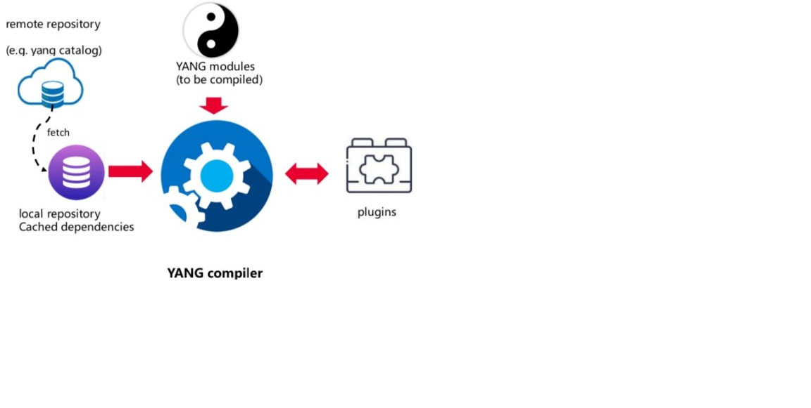

# YANG Compiler

## Overview

YANG Compiler is a plugin-extensible tool for compiling and processing YANG models. Built on [YangKit](https://github.com/yang-central/yangkit), it helps developers validate models, resolve dependencies, retrieve missing modules, and build custom workflows through built-in and external plugins.

## Architecture

The compiler resolves input modules and their dependencies through configurable sources, then executes processing steps through a plugin-based workflow.



## Key Capabilities

- Compile and process YANG models from files, directories, and module references
- Resolve dependencies automatically: local repository → `settings.json` module info → remote repository ([yangcatalog](https://yangcatalog.org/api/) by default)
- Cache retrieved modules in the local repository (`{user.home}/.yang`) for future use
- Validate YANG models and write results to a report file via the built-in `validator_plugin`
- Extend processing through built-in or external plugins, each configurable with custom parameters
- Configure global behavior through `settings.json` (repository paths, proxy, authentication)
- Define reproducible build workflows through `build.json` (inputs, plugins, parameters)
- Install compiled YANG files into the local repository with the `install` flag

## Installation

### Prerequisites

* JDK or JRE 1.8 or above

### Obtain and build

```bash
git clone https://github.com/yang-central/yang-compiler.git
cd yang-compiler
mvn clean install
```

This generates `yang-compiler-1.0-SNAPSHOT.jar` and a `libs` directory under `target/`.

## Quick Start

Wrapper scripts (`yangc` on Linux/macOS, `yangc.bat` on Windows) are provided so you never need to type the full `java -jar` command.

```bash
# Linux/macOS — make executable once
chmod +x yangc
```

```bash
# Scaffold a new project (creates yang/, build.json, settings.json)
./yangc init

# Compile all YANG files in a directory (default: validator_plugin)
./yangc compile ./yang

# Resolve and compile a module by name
./yangc compile ietf-interfaces

# Compile a specific revision with a custom plugin and parameter
./yangc compile ietf-interfaces@2018-02-20 --plugin yangtree_generator --param output=tree

# Run a full build from build.json
./yangc

# Run a full build and install compiled files into the local repository
./yangc option=my-build.json install
```

## Documentation

* [User Guide](docs/user-guide.md) — CLI reference, settings, build options, and more.
* [Developer Guide](docs/developer-guide.md) — how to develop built-in and external plugins.
